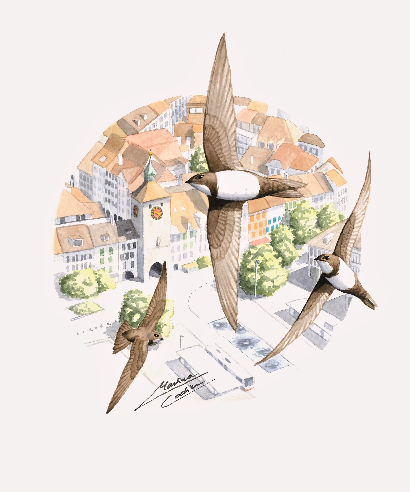
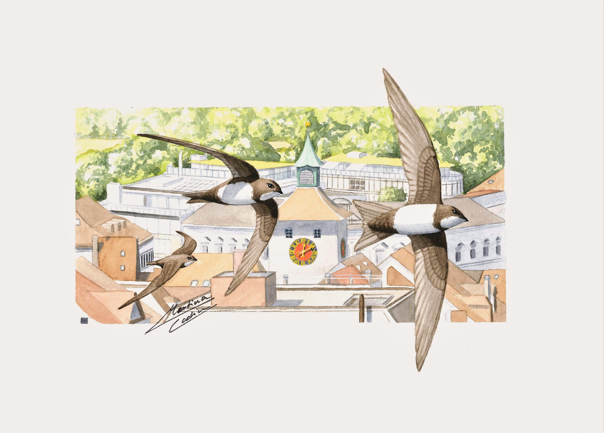

[PAGE UNDER CONSTRUCTION]

  
  <h3><a href="projects/sexual_dimorphism.qmd">Evolutionary Causes & Consequences of Sexual Dimorphism</a></h3>
  
Work undertaken in the context of my PhD and Postdoc in collaboration with Julien Martin & Pierre Bize. 

  
  <h3><a href="projects/spatial_population_structure.qmd">Using Behavioural Strategies to Define Spatial Population Structures</a></h3>
  
Work undertaken in the context of a Postdoc in collaboration with Glen Brown, Jeff Brown, Stephanie Blain.

